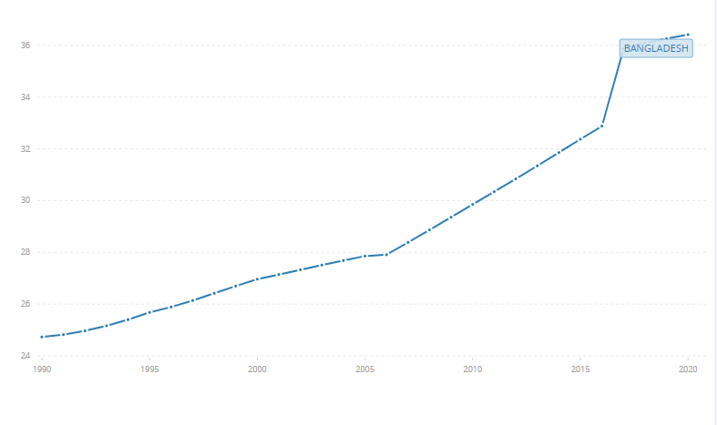
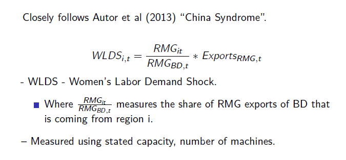

class: inverse

```{r setup, include=FALSE}

knitr::opts_chunk$set(echo = FALSE)
knitr::opts_chunk$set(out.height = "\\textheight",  out.width = "\\textwidth")

options(htmltools.dir.version = FALSE)
library(pacman)
p_load(tidyverse, viridis, extrafont, gridExtra, knitr, sf, hrbrthemes, lwgeom, rnaturalearth, maps, mapdata, spData, leaflet, plotly, ggmap)

# Define pink color
red_pink <- "#e64173"
turquoise <- "#20B2AA"
grey_light <- "grey70"
grey_mid <- "grey50"
grey_dark <- "grey20"
# Dark slate grey: #314f4f
# Knitr options
opts_chunk$set(
  comment = "#>",
  fig.align = "center",
  fig.height = 7,
  fig.width = 10.5,
  warning = F,
  message = F
)
opts_chunk$set(dev = "svg")
options(device = function(file, width, height) {
  svg(tempfile(), width = width, height = height)
})
# A blank theme for ggplot
theme_empty <- theme_bw() + theme(
  line = element_blank(),
  rect = element_blank(),
  strip.text = element_blank(),
  axis.text = element_blank(),
  plot.title = element_blank(),
  axis.title = element_blank(),
  plot.margin = structure(c(0, 0, -0.5, -1), unit = "lines", valid.unit = 3L, class = "unit"),
  legend.position = "none"
)
theme_simple <- theme_bw() + theme(
  line = element_blank(),
  panel.grid = element_blank(),
  rect = element_blank(),
  strip.text = element_blank(),
  axis.text.x = element_text(size = 18, family = "STIXGeneral"),
  axis.text.y = element_blank(),
  axis.ticks = element_blank(),
  plot.title = element_blank(),
  axis.title = element_blank(),
  # plot.margin = structure(c(0, 0, -1, -1), unit = "lines", valid.unit = 3L, class = "unit"),
  legend.position = "none"
)
theme_axes_math <- theme_void() + theme(
  text = element_text(family = "MathJax_Math"),
  axis.title = element_text(size = 22),
  axis.title.x = element_text(hjust = .95, margin = margin(0.15, 0, 0, 0, unit = "lines")),
  axis.title.y = element_text(vjust = .95, margin = margin(0, 0.15, 0, 0, unit = "lines")),
  axis.line = element_line(
    color = "grey70",
    size = 0.25,
    arrow = arrow(angle = 30, length = unit(0.15, "inches")
  )),
  plot.margin = structure(c(1, 0, 1, 0), unit = "lines", valid.unit = 3L, class = "unit"),
  legend.position = "none"
)
theme_axes_serif <- theme_void() + theme(
  text = element_text(family = "MathJax_Main"),
  axis.title = element_text(size = 22),
  axis.title.x = element_text(hjust = .95, margin = margin(0.15, 0, 0, 0, unit = "lines")),
  axis.title.y = element_text(vjust = .95, margin = margin(0, 0.15, 0, 0, unit = "lines")),
  axis.line = element_line(
    color = "grey70",
    size = 0.25,
    arrow = arrow(angle = 30, length = unit(0.15, "inches")
  )),
  plot.margin = structure(c(1, 0, 1, 0), unit = "lines", valid.unit = 3L, class = "unit"),
  legend.position = "none"
)
theme_axes <- theme_void() + theme(
  text = element_text(family = "Fira Sans Book"),
  axis.title = element_text(size = 18),
  axis.title.x = element_text(hjust = .95, margin = margin(0.15, 0, 0, 0, unit = "lines")),
  axis.title.y = element_text(vjust = .95, margin = margin(0, 0.15, 0, 0, unit = "lines")),
  axis.line = element_line(
    color = grey_light,
    size = 0.25,
    arrow = arrow(angle = 30, length = unit(0.15, "inches")
  )),
  plot.margin = structure(c(1, 0, 1, 0), unit = "lines", valid.unit = 3L, class = "unit"),
  legend.position = "none"
)
```

# Research question

To what extent did the labor demand shock in the form of opportunities in the garments industry 

i) change female labor force participation, 

ii) education, and

ii) female fertility?

- Data permitting, I will also look at marriage age, marriage formation rates and divorce rates.

---
# Rise of Garments in Bangladesh

```{r}
include_graphics("1.png" )
```

Source: BGMEA
---
# Rise of Garments in Bangladesh

```{r}
include_graphics("2.png" )
```

Source: World Bank
---
# Women at work

## FLFPR (Percetage 15+)
```{r}

```
Source: World Bank
---

# Women in work

- Labor force participation is about 49% in 20-24 cohort (ADB 2016)

## Women in RMG

- About 60%  - 80% of workers in RMG industry are women (World Bank, 2017, ILO, 2020).

- This is about 4 million of women using the lower estimate.

  - 20% of female labor force participation comes from RMG (my estimates).


---
# Fertility rates

## One of the sharpest declines in fertility rates

```{r}
include_graphics("4.png" )
```
Source: World Bank
---

# Women in school

Lower secondary (about middle school) completion rates in total female population  completion rate of __4.4% in 1981__ to .hi[41% in 2019.] (World Bank, 2020)

Literacy among .hi[15-24 age group exceeds 96 percentage in 2019.] (World Bank, 2020)

Did not present in graph due to unavailability of data across all years.

---
# Prior research

## Heath and Mobarak (2015, JDE)

- Survey of 1395 households in 60 regions, 44 in garments commuting zones
16 away

- Three identification strategy
  - Girls in villages in the same sub-districts that are further away from factories, (parallel pre-trends) 
  - Before and after of garments move
 
- They find  that girls exposed to the garment sector
  - Delay in marriage and childbirth (Decline in fertility)
  - More likely to be enrolled in school
  - Older girls becoming more likely to be employed

---
# Metholodology 

## Summary

The steps in this research are:

- Define regions (commuting zones ?)

- Use Demographic Health Survey (DHS) data, along with their cluster co-ordinates

  - Estimate values in the regions
  
- Collect location of garment factories, geo-code them

- Use regression to measure the impact of labor demand shock on variables of interest in different regions with variable rates of exposure to demand shock (could be zero).

---
# Metholodology 

## Specification

```{r}
include_graphics("5.png" )
```

---
# Metholodology 

## Specification

```{r}

```

---
# Data

## DHS

- Surveys (sample size) in 2000 (9854), 2004 (10,500), 2007 (10,400), 2011 (17,141), 2018 (20,127).

- Number of clusters (sub-divisions of Bangladesh made by DHS) 341,359,361,600,359 and 672 respectively.

---
# Data: DHS Clusters Map

- Have a random measurement error of 0-2 KMs for urban, 0-5 KMs for rural, 0-10 KMs for 1% of rurals.

```{r}
garments <- read.csv("C:/Users/shiha/Dropbox/University of Oregon/Research/Bangladesh FLFPR/Data/Factory data/factorydataBGMEA_base.csv") %>%
  drop_na()

garments <- garments %>%
  filter(Latitude >20, Latitude<26) %>%
  filter(Longitude > 88, Longitude<92)

garments <- st_as_sf(garments, coords = c("Longitude", "Latitude")) %>% st_set_crs(3106)
#garments <- st_transform(garments, crs = 3106 )

```


```{r}
# Bangladesh zones 0 - country map, 1 - div, 2- district, 3-sub-district, 4 - smaller
geo_bd <- "C:/Users/shiha/Dropbox/University of Oregon/Research/Bangladesh FLFPR/Data/Bd admin and roads/bgd_adm_bbs_20201113_shp/bgd_admbnda_adm2_bbs_20201113.shp"
bd_map <- st_read(geo_bd, quiet = TRUE)

# Smaller
geo_bd1 <- "C:/Users/shiha/Dropbox/University of Oregon/Research/Bangladesh FLFPR/Data/Bd admin and roads/bgd_adm_bbs_20201113_shp/bgd_admbnda_adm4_bbs_20201113.shp"
bd_map1 <- st_read(geo_bd1, quiet = TRUE)

# Roads
bdroads <- "C:/Users/shiha/Dropbox/University of Oregon/Research/Bangladesh FLFPR/Data/Bd admin and roads/bgd_trs_roads_lged/bgd_trs_roads_lged.shp"
bdroads <- st_read(bdroads, quiet = TRUE)
```


```{r cluster_map}

# Dowloading the shape files from DHS cluster zones

geo_clusters41 <- "C:/Users/shiha/Dropbox/University of Oregon/Research/Bangladesh FLFPR/Data/DHS/DHS GPS/BDGE42FL/BDGE42FL.shp"
clusters41 <- st_read(geo_clusters41, quiet = TRUE)
clusters41 <- clusters41 %>%
  select(DHSYEAR, DHSCLUST, URBAN_RURA, geometry)
  
geo_clusters42 <- "C:/Users/shiha/Dropbox/University of Oregon/Research/Bangladesh FLFPR/Data/DHS/DHS GPS/BDGE4JFL/BDGE4JFL.shp"
clusters42 <- st_read(geo_clusters42, quiet = TRUE)
clusters42 <- clusters42 %>%
  select(DHSYEAR, DHSCLUST, URBAN_RURA, geometry)
  
clusters42 <- clusters42[-c(325, 326), ]

geo_clusters5 <- "C:/Users/shiha/Dropbox/University of Oregon/Research/Bangladesh FLFPR/Data/DHS/DHS GPS/BDGE52FL/BDGE52FL.shp"
clusters5 <- st_read(geo_clusters5, quiet = TRUE)
clusters5 <- clusters5 %>%
  select(DHSYEAR, DHSCLUST, URBAN_RURA, geometry)

geo_clusters6 <- "C:/Users/shiha/Dropbox/University of Oregon/Research/Bangladesh FLFPR/Data/DHS/DHS GPS/BDGE61FL/BDGE61FL.shp"
clusters6 <- st_read(geo_clusters6, quiet = TRUE)
clusters6 <- clusters6 %>%
  select(DHSYEAR, DHSCLUST, URBAN_RURA, geometry)

geo_clusters71 <- "C:/Users/shiha/Dropbox/University of Oregon/Research/Bangladesh FLFPR/Data/DHS/DHS GPS/BDGE71FL/BDGE71FL.shp"
clusters71 <- st_read(geo_clusters71, quiet = TRUE)
clusters71 <- clusters71 %>%
  select(DHSYEAR, DHSCLUST, URBAN_RURA, geometry)

clusters71 <- clusters71[-c(544), ]

geo_clusters72 <- "C:/Users/shiha/Dropbox/University of Oregon/Research/Bangladesh FLFPR/Data/DHS/DHS GPS/BDGE7RFL/BDGE7RFL.shp"
clusters72 <- st_read(geo_clusters72, quiet = TRUE)
clusters72 <- clusters72 %>%
  select(DHSYEAR, DHSCLUST, URBAN_RURA, geometry)


# Consolidation
cluster_map <- rbind(clusters41, clusters42, clusters5, clusters6, clusters71, clusters72)

ggplot(bd_map) +
  geom_sf(col = "black", size = 0.05) +
  geom_sf(data = cluster_map, aes(col = as.character(DHSYEAR)), size = 0.5) +
  facet_wrap(~DHSYEAR)
```

---
# Data

## Factory data

- I scraped the website of Bangladesh Garments Manufacturers and Exporters Association (BGMEA) and found data on

  - Factory address (geo-coded about 1/2 of them)
  - Establishment date 1978 - 2021
  - Data on number of machines, capacity and number of management employee (13,000 - 10.
    - I highly doubt the management employee data.
    
- Currently trying to scrape the website of knitwear manufacturers.  But double counting is probable.

---
# Garments locations

Needs work!

```{r}
include_graphics("7.png" )
```

---
# Expected contribution

## What does this research bring ?

- Longer horizon allows us to pick up changes in norms / information assimilation about women in work.
  - Basically, lets us pick up some of the peer effects.
  
- This potentially adds more information in our measure of labor demand shock than previous studies.

- Risk

  - More patchy data considering the difficulty of conceiving of regions and the random error introduced to co-ordinates in DHS clusters.

---
# Regions/Commuting zones

## How do I concieve of regions ?

- I have data on administrative boundaries
  - But economic activity (commute, et cetera) does not follow strict administrative boundaries.
  
- I have data on road locations

- Both are pretty detailed.

---

# Roads

Maybe some sort of distance ?

```{r}
union_road <- bdroads %>%
  filter(FType == "Union Road")

ggplot(bd_map) +
  geom_sf(data = union_road )
```
