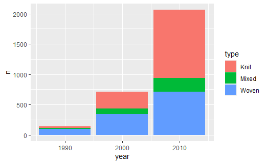
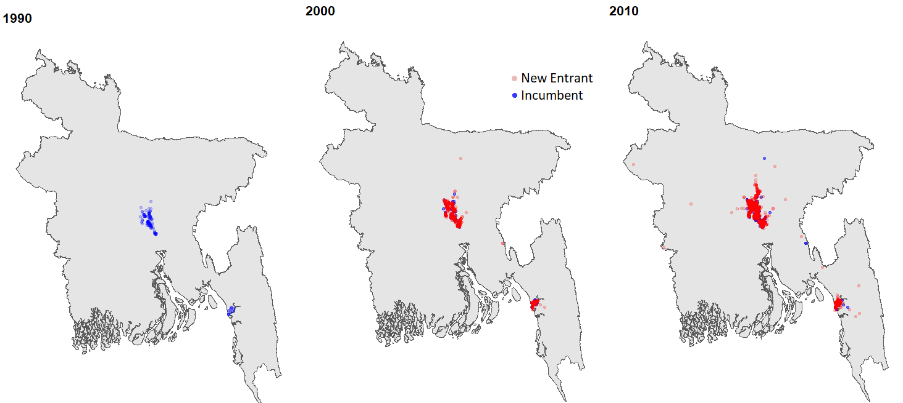

```{r setup, include=FALSE}

knitr::opts_chunk$set(echo = FALSE)

options(htmltools.dir.version = FALSE)

library(pacman)


# Non-geo packages

p_load(readxl, tidyverse, knitr, gridExtra, stargazer, broom, magick, cowplot, gganimate, ggplot2, ggrepel, kableExtra)

# geo packages
p_load(sp, sf) 

p_load(conflicted)
conflict_prefer("select", "dplyr")
conflict_prefer("filter", "dplyr")
conflict_prefer("lag", "dplyr")


# Define pink color
red_pink <- "#e64173"
turquoise <- "#20B2AA"
grey_light <- "grey70"
grey_mid <- "grey50"
grey_dark <- "grey20"
# Dark slate grey: #314f4f
# Knitr options
opts_chunk$set(
  comment = "#>",
  fig.align = "center",
  warning = F,
  message = F
)
opts_chunk$set(dev = "svg")
options(device = function(file, width, height) {
  svg(tempfile(), width = width, height = height)
})
```

class: inverse, middle, center

# Introduction

---
# Against the grain: Bangladeshi FLFP

```{r, fig.height = 4.5, fig.width = 8}

flfp <- read.csv("flfp.csv", check.names=FALSE) %>%
    pivot_longer(-year, names_to="Country", values_to="flfp")

flfp_start <- flfp %>%
  filter(year == 1990)

flfp_end <- flfp %>%
  filter(year == 2019)


ggplot(flfp, aes(x = year, y = flfp)) +
  geom_line(aes(col = Country)) +
  geom_line(data = subset(flfp, Country =="Bangladesh"), color = "red", size =1.25) +
geom_text_repel(
    aes(label = round(flfp,1)), data = flfp_start,
    fontface ="plain", color = "black", size = 2
    ) +
geom_text_repel(
    aes(label = round(flfp,1)), data = flfp_end,
    fontface ="plain", color = "black", size = 2
    )+
   labs(title="FLFP over time", y = "FLFP", x = "Year", caption = "World Bank (2021)") +
  theme(legend.position="bottom")
```

- .hi[Female labor force participation (FLFP)] among 20-24 year olds stood at about 49% in 2015 (ADB 2016).

---
# Expansion of the garments industry

 - Bangladeshi .hi[Ready Made Garments (RMG)] grew at about 11% a year since 1991.

--

.pull-left[
```{r fig.env='figure', strip.white=TRUE, out.width = "100%"}
read.csv("bgmea.csv") %>% 
  ggplot(aes(x = year, y = export/1000))+
  geom_bar(stat="identity", fill="light blue")+theme_bw() +
  labs(title="RMG Exports 1983-2020", y = "Exports(Billions)", x = "Year", 
       caption = "(Source:BGMEA)") + theme(panel.border = element_blank())
```
]

.pull-right[ 

- <font size="5"> Accounts for 75-85% of Bangladesh's exports in recent decades.

]

--

.pull-right[

- Contributed about 5-6% to GDP in 2019.

]

--

.pull-right[

- .hi[About 60% of workers in export oriented RMG industry are women.]

</font>
]

---
# Garments and FLFP

## A long history

- Textile and affiliated industry always employed relatively more women across different time and place.

--

  - Mid 1800s England (Burnette, n.d), USA (Field-Hendrey, 1998); developed and developing countries 1981-2008 (Kucera and Tejani, 2014).
  
--
  
  - Women engaged in more spinning and knitting for centuries *(Virginia Postrel, Textiles and the Fabric of Civilization)*
  
--

  - Did this "kick" off an overall FLFP transition in lines of Fogli and Veldkamp (2011)?

---
# FLFP, Reproduction and HCA

## Reproductive behavior

- Labor market opportunities changes net benefits of marriage and children *(e.g. Aaronson et al 2014; Greenwood et al 2017).*

--

- But fertility transition was already on the way and may have already ushered in a low-fertility enviroment? What about timing?

--

## Human capital accumulation

- More schooling if returns to schooling in RMG industry is adequate. Less if potential students are better off working.

  - Maybe less schooling but more human capital accumulation through increased effort?
--

.hi[All these are empirical questions!]

---
# Research questions

  1. To what extent did the emergence of the RMG industry contribute to the increase in FLFP in Bangladesh?
  
    - A question about magnitude.
--

  2. What is the effect of the RMG industry on reproductive behavior of women (marriage and fertility)?
    
    - A question about sign and magnitude.
  
--

  3.  What is the effect of the RMG industry on human capital accumulation of Bangladeshi women?
  
    - A question about sign and magnitude.

---
# Preview of the paper

## Methods

 - Estimates the long run impact of female labor demand shock on FLFP, fertility and human capital accumulation by:

  - Bartik shift-share method to identify labor demand shocks following a methodology similar to .hi[Autor et al (2013).]
  
  - Specifically, I exploit product specialization in the RMG industry along the knit versus woven line across sub-districts (Bangladesh administrative level-3) for identification.

---
# Preview of the paper

## Results

- FLFP, particularly industrial FLFP changes a lot.

--

- Not much of an impact on reproductive behavior and fertility overall.


-- Results can be rationalized with previous literature under plausible assumptions.

---
# Why do we care?

1. Adds to the literature on manufacturing- and export-led growth. Especially relevant since:

--
  - General concerns with pre-mature industrialization (Rodrik, 2015)
  
  - Reductions in prevalence of women in RMG industry in Bangladesh <footnote>A [Along the lines of what happens as technology improves in a manufacturing sector (Tejani and Kucera, 2021).</footnote>

--

2. Adds to the literature focusing on trade and lives of workers (Autor et al (2013), Li (2018) and Autor et al (2019)).

---

class: inverse, middle, center

# RMG industry in Bangladesh

---
# Knit versus Woven prodcuts

.pull-left[

.hi[Knit]

```{r, out.width="70%"}
include_graphics("figures//knit1.png")
```

- Single yarn looped repeatedly.
- HS code 61.
- Product examples: Most sweaters, cotton T-shirts.
]

--

.pull-right[

.hi[Woven]

```{r, out.width="68%"}
include_graphics("figures//woven1.png")
```

- Multiple yarn criss-crossed over and under each other.
- HS code 62.
- Product examples: Shirts, jackets, pants.
]
---
# Knit versus Woven Specialization

```{r out.width="70%"}

```

--

- Producing woven is more energy and capital intensive, and commands about 10% higher per unit price (Sytsma, 2022).

--

- Woven factories are larger, and employs more women.

---
# Location of RMG factories

```{r out.width="90%"}

```

--

- RMG factory location choice is mostly dependent on infrastructure quality (kagy, 2014).

---
count:false

class: inverse, middle, center

# Identification strategy and data

---
# Overview of the identification strategy


  - Sub-districts with and without factories are likely to have different infrastructure quality, which maybe correlated with outcome variables. So, .hi[I restrict the analysis only to sub-districts that had a factory by 2006.]
  
--

  - Different sub-districts have different intensity of knit versus woven specialization **within** the RMG industry.  

--
    - Adopting Goldsmith-Pinkham et al (2020), the key assumption is that these differences in specialization do not change outcomes through confounders.
 
---
# Regression Model


\begin{equation}
  \Delta Y_{s,t} = \beta \space \Delta \text{Export Exposure}_{s,t} + \delta_{t}  + Z_{s,t-1} \beta_z + X_{s,t-1} \beta_x + \epsilon_{s,t}
\end{equation}

- $\Delta Y_{s,t}$ is the decadal change in outcome variables in sub-district $s$ over decade ending at year $t$.

--

- $\text{Export Exposure}_{s,t}$ measures export exposure in sub-district over decade ending at year $t$.

--

- $\delta_t$ are period fixed-effects and $Z_{s, t-1}$ is a vector of controls across all outcomes including start of period electrification rate, urbanization, density, share of 15-64 year old in population and years of education for adults (15-64).

--

- $X_{s,t-1}$ are start of the period comparable outcomes for males other than in the cases of regressions corresponding to marriage and fertility rates.


---
# Export exposure

One candidate measure of export exposure per potential worker (Population 15-64) is: 

\begin{equation}
  \sum_{i=0}^{9} \alpha_{s,t-i}^{K} * \frac{\text{Export}_{BD,t-i}^{K}}{L_{s,t-i}} + \sum_{i=1}^{9} \alpha_{s,t-i}^{W} * \frac{\text{Export}_{BD,t-i}^{W}}{{L_{s,t-i}}} \\
 \alpha_{s,t-i}^{K} = \frac{Machines_{s,t-i}^{K}}{Machines_{BD,t-i}^{K}}, 
\alpha_{s,t-i}^{W} = \frac{Machines_{s,t-i}^{W}}{Machines_{BD,t-i}^{W}}
\end{equation}

--

 - Apportions total knit (woven) exports originating in Bangladesh to a sub-districts based on what share of national knit (woven) production is in the sub-district.

--

  - Export exposure in sub-district $s$ in at time period $t$ depends on the intensity of knit (woven) specialization and is scaled by total exports and population.
  
---
# Export exposure

- But clearly the previous measure can be endogenous since over decades, infrastructure changes and that in itself could change both the shares and change the outcomes differentially. So, I fix share to the values at the start of decade. Thus export exposure per potential worker is as follows:

\begin{align}
  \Delta \text{ Export Exposure}_{s,t} =& \alpha_{s,t-1}^{K} * \frac{\Delta \space \text{Export}_{BD,t}^{K}}{L_{t-1}} + \alpha_{s,t-1}^{W} * \frac{\Delta \space \text{Export}_{BD,t}^{W}}{L_{t-1}} 
\end{align}


---
# Identifying Assumptions

Adopting from Goldsmith-Pinkham et al (2020), the key assumption is that the differences in knit versus woven specialization do not *change* outcomes through confounders. That is:

- .hi[Identifying assumption 1:] Extent of knit versus woven specialization in a sub-district is uncorrelated with the errors conditional on controls in the first difference equations.

--

- .hi[Identifying assumption 2:] FLFP responds similarly to woven and knit shocks.

--

- .hi[Example of a violation:]	Woven employs more women, so areas with more woven factories has increased presence of fertility control programs because there are more women.

---
# Data Sources

- .hi[Outcome data] is obtained by aggregating individual-level data from the Bangladesh Census 1991 (10% sub-sample), 2001 (10% sub-sample) and 2011 (5% sub-sample).

--

- .hi[Factory data] are primarily from  multiple BGMEA datasets from members directory (2001, 2010), BGMEA (2015) and scraping of BGMEA websie in 2013.

---
class: inverse, middle, center

# Results

---
# FLFP

## Overall

```{r, include=F}

#load("C:/Users/smshi/Dropbox/Research/BD-RMG-Women/data/final_data.RData")

# garments adjacent

reg_flfp <- data.frame(Age = c("15-64", "15-29", "15-20"),
                       coeff = c(0.004, 0.005, 0.006  ),
                       std_error = c(0.0006, 0.0008, 0.0009))

reg_flfp_ind <- data.frame(Age = c("15-64", "15-29", "15-20"),
                       coeff = c(0.007, 0.006, 0.007),
                       std_error = c(0.0008, 0.0006, 0.0007))

reg_flfp_mar <- data.frame(Age = c("15-20", "21-30"),
                       coeff = c(-0.0004, 0.0001),
                       std_error = c(0.0005, 0.0004))


reg_flfp_fert <- data.frame(Age = c("15-20", "21-30", "15-20"),
                       coeff = c(0.0001, 0.0000, 0.0036),
                       std_error = c(0.0004, 0.0015, 0.0023))


reg_enrol <- data.frame(Age = c("05-09", "10-13", "14-19"),
                       coeff = c(0.0009, -0.0002, -0.0013),
                       std_error = c(0.0008, 0.0008, 0.0011))
```

```{r}
kable(list(reg_flfp, reg_flfp_ind), align = "ccc", caption = "Influence on overall (left) and industrial (right) FLFP")
```


- Modest impact on FLFP that is stronger on industrial FLFP and among younger women. 

--
- At mean export exposure for a sub-district over two decades:

  - FLFP increases by 3.45 percentage point overall, 6.04 for industrial FLFP.
  
- More than half of industrial FLFP change is from RMG industry.
  
---
# Reproductive behavior 

```{r}
kable(list(reg_flfp_mar, reg_flfp_fert), align = "ccc", caption = "Influence on marriage rates (left) and fertility (right)")
```

- Signs as I expected, but not statistically significant.

---
# Human capital accumulation

```{r}
kable(reg_enrol, align = "ccc", caption = "Influence on schooling rates of women")
```

- Signs as I expected, but not statistically significant.
---
# Conclusions

- Results indicate that the RMG industry provided opportunities for some of the women to join manufacturing labor force.

--

- However, most changes in reproductive and human capital likely driven by other factors.
--


.hi[Thank you. Suggestions and comments are very appreciated!]