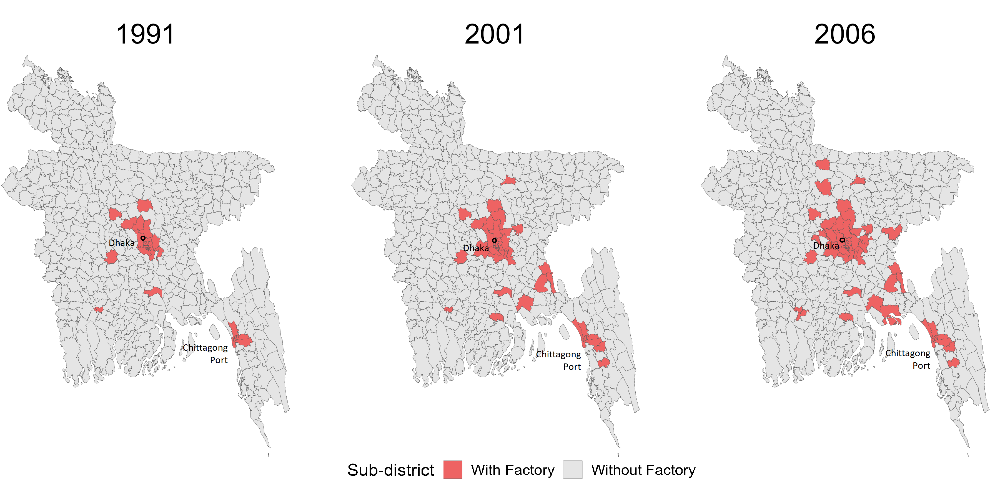
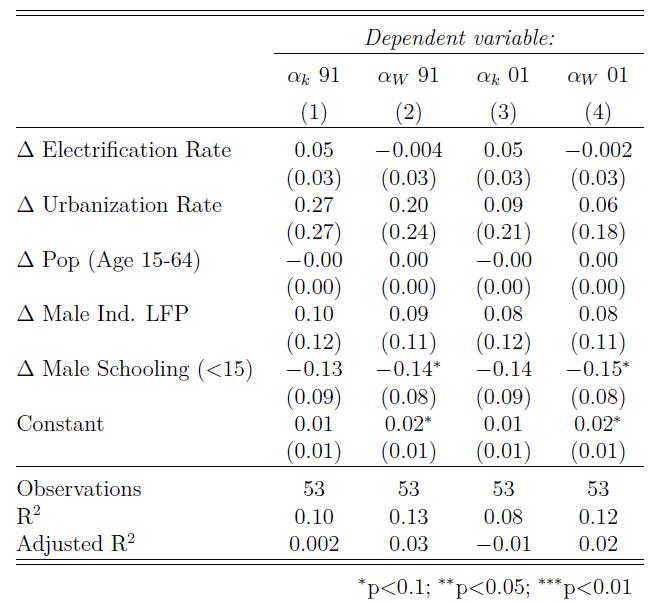
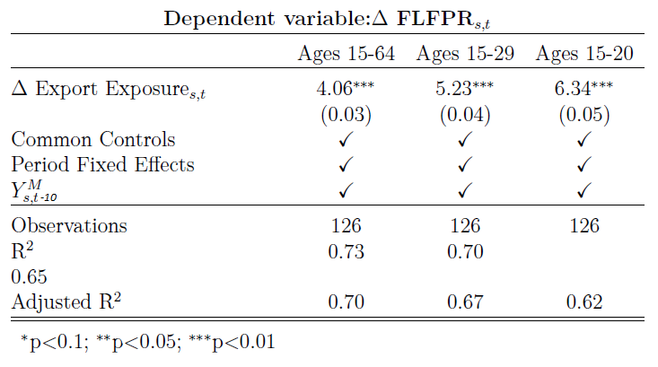
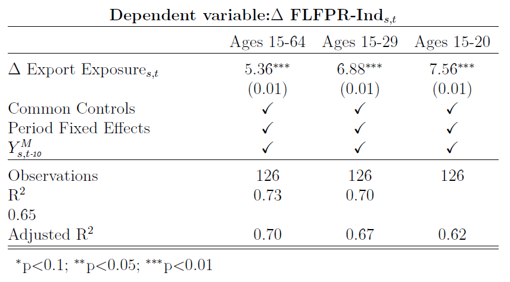
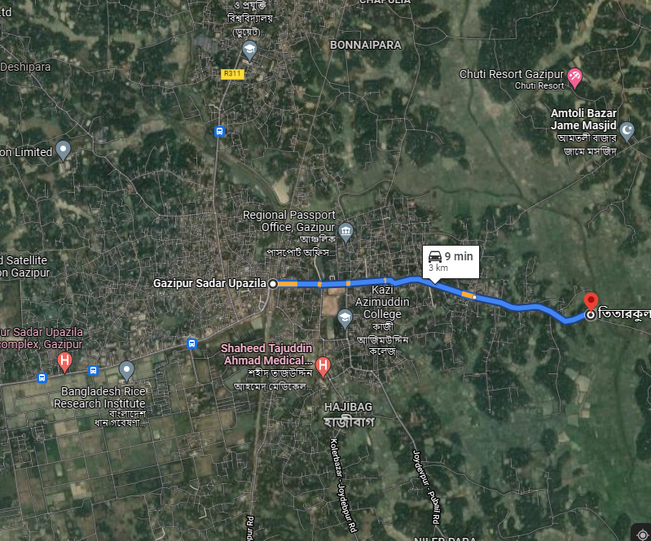
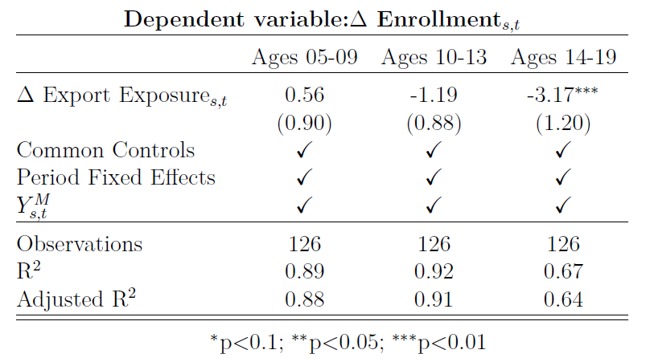
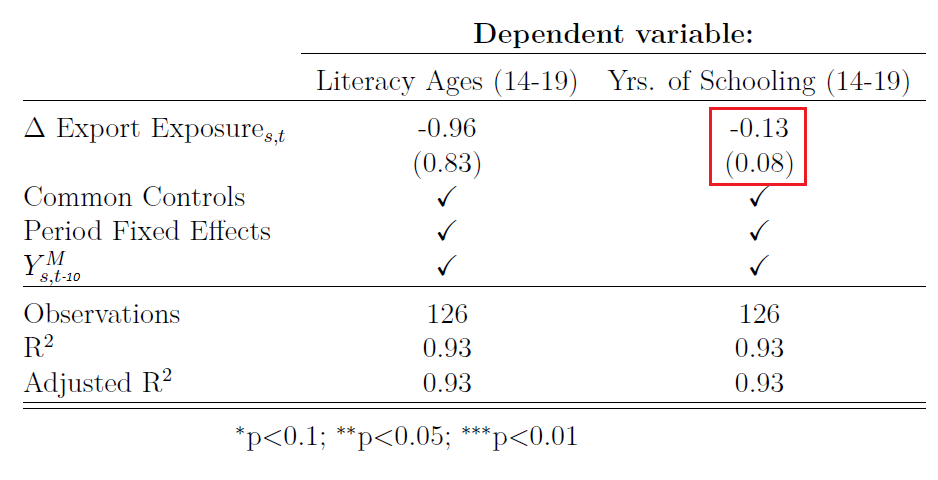
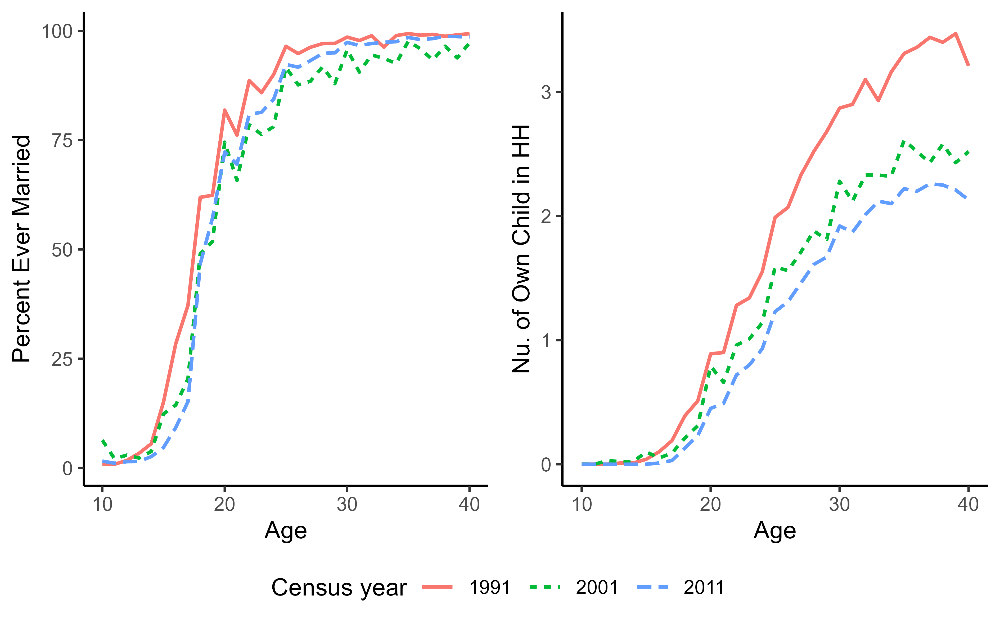
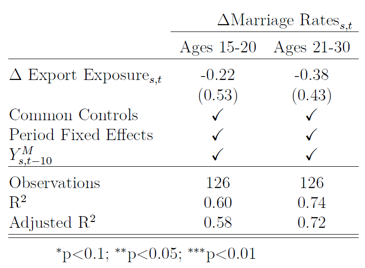
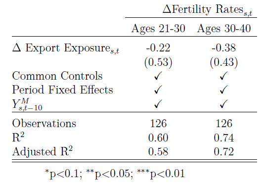

```{r setup, include=FALSE}

knitr::opts_chunk$set(echo = FALSE)

options(htmltools.dir.version = FALSE)

library(pacman)


# Non-geo packages

p_load(readxl, tidyverse, knitr, gridExtra, stargazer, broom, magick, cowplot, gganimate, ggplot2, ggrepel, kableExtra)


# geo packages
p_load(sp, sf) 

p_load(conflicted)
conflict_prefer("select", "dplyr")
conflict_prefer("filter", "dplyr")
conflict_prefer("lag", "dplyr")


# Define pink color
red_pink <- "#e64173"
turquoise <- "#20B2AA"
grey_light <- "grey70"
grey_mid <- "grey50"
grey_dark <- "grey20"
# Dark slate grey: #314f4f
# Knitr options
opts_chunk$set(
  comment = "#>",
  fig.align = "center",
  warning = F,
  message = F
)
opts_chunk$set(dev = "svg")
options(device = function(file, width, height) {
  svg(tempfile(), width = width, height = height)
})
```

# Introduction

Since 1960s, developing countries experienced:

--
- Large .hi[declines in fertility]

--

- Improvements in .hi[women's education]

--

Can .hi[industrialization] friendly towards .hi[women's employment] explain these changes?

--

$\uparrow$ Opportunity costs in child-bearing and child-rearing

--

$\uparrow$ Returns to human capital in agrarian settings

--

$\implies$ Fertility reduction and increased human capital accumulation 

.footnote[
[1] *Ager et al (2020), Guldi and Rahman (2022), and Brown and Guinnane (2018)* shows that a similar dynamic played out during the second industrial revolution in US and Europe.]

---
# Introduction

Bangladesh started industrialization in 1980s through .hi[Garment manufacturing]
  
--

  - First .hi[non-farm employment opportunity] for millions of women
  
--

  - In a context of high fertility, low education, and  non-coercive family planning program
  
--

Allows me to examine the salience of industrialization $\rightarrow$ $\uparrow$ women's employment $\rightarrow$ $\downarrow$ fertility & $\uparrow$ human capital accumulation of women.

--

Specifically, I test the .hi[effect of women's employment opportunities in garment manufacturing on:]  

--

- **Female labor force participation (FLFP)**
- Age-specific marriage and fertility rates
- School enrollment, literacy, and years of schooling

---
# Why do we care?

.hi[Manufacturing- and export-led growth and development] is important. Especially relevant since:

--

  - Pre-mature de-industrialization in developing countries (Rodrik, 2016).

--
  
  - Prevalence of women in garments industry is decreasing in Bangladesh.<sup>1<sup>
  
--

Adds to the literature focusing on .hi[trade and lives of workers] *(Autor et al (2013), Atkin (2016), Li (2018) and Autor et al (2019))*.


.footnote[ [1] Along the lines of what happens as technology improves in a manufacturing sector (Tejani and Kucera, 2021).]
---
# Related work

.hi[Heath and Mobarak (2015, JDE)] finds that Bangladeshi garments industry:

- Increased FLFP substantially, delayed marriage, and reduced fertility; and reduced women's education gap.

--

- Individual data is from a 2009 survey of 1395 households in sixty villages in four regions with garments.

--

  - Relatively large distance between villages near and far from garments. Estimated treatment  effect may reflect spatial pattern of development.

--

- Factory data is from a 2014 survey of local individuals. 

--

In contrast, I use .hi[census data], and .hi[construct a detailed factory-level dataset] of nearly all exporting garment factories across all regions of Bangladesh between 1991-2006. 

---
# Preview of the paper

## Methods

I estimate the long run effect of employment opportunities on FLFP, reproductive, and human capital accumulation choices by:

--

 - Using shift-share methods from the trade literature
 
--
  
 - Specifically, my .hi[identifying variation comes from differences in product specialization] within the garment industry only in regions that had garments in them.

---
# Preview of the paper

## Results

Employment opportunities in garment industry led to:

--

- .hi[Substantial increases in FLFP], and especially industrial FLFP

--

- .hi[Small decline in school] enrollment 

  - No statistically significant changes in literacy rates or years of schooling
  
--

- No changes in age-specific marriage and fertility rates.

---
# Organization of the paper

The rest of the presentation will:

- Discuss the context and economic question in greater detail

--

- Present the methodology and data

--

- Present the findings

--

- Conclude the paper


---
class: inverse, middle, center

# The Garments Industry and Women's Employment Oppurtunity

---
# Garments industry expansion

.pull-left[
```{r fig.env='figure', strip.white=TRUE, out.width = "100%"}
read.csv("bgmea.csv") %>% 
  ggplot(aes(x = year, y = export/1000))+
  geom_bar(stat="identity", fill="light blue")+theme_bw() +
  labs(title="Garment Exports 1983-2020", y = "Exports (Billions)", x = "Year", 
       caption = "(Source: BGMEA)") + theme(panel.border = element_blank()) +
  theme(text = element_text(size = 24))
```
]

.pull-right[ 

- <font size="5">  Grew at .hi[11% per year] since 1991.

]

--

.pull-right[

- Second largest exporter of garments in the world, and accounts for .hi[85% of Bangladesh's exports] in recent decades.

]

--

.pull-right[

- Accounted for about .hi[33% of industrial employment] in 2017.

</font>
]
---
# Knit versus woven prodcuts

Ready made garments account for .hi[more than 90%] of exports

--

Two broad categories of products:
--

.pull-left[

.hi[Knit: HS code 61]

```{r, out.width="55%", fig.align = "left"}
include_graphics("figures//knit1.png")
```

Single yarn looped repeatedly

Examples: Most sweaters, cotton T-shirts
]

--
.pull-right[

.hi[Woven: HS code 62]

```{r, out.width="52%", fig.align='left'}
include_graphics("figures//woven1.png")
```

Multiple yarn criss-crossed over and under each other

Examples: Shirts, jackets, pants.
]
---
# .smaller[Knit versus woven specialization]

```{r out.width="65%"}
include_graphics("figures//knitWov.png")
```

--

- Producing woven is more energy and capital intensive, and commands about 10% higher per unit price (Sytsma, 2022).

--

- Woven factories are larger, and employs more women.

--

- Labor tasks overlap.
---
# Garments and FLFP

## A long history

Textile and affiliated industry always employed relatively more women across different time and place.

--

- Mid 1800s England (Burnette, 2008), USA (Field-Hendrey, 1998); developed and developing countries 1981-2008 (Kucera and Tejani, 2014).
  
--
  
- Women engaged in more spinning and knitting for centuries *(Virginia Postrel, Textiles and the Fabric of Civilization)*
  
--

- Surveys find that as high as .hi[60% of workers] in exporting garments industry are women.

---
# .smaller[Against the grain: Bangladeshi FLFP]

```{r, fig.height = 4.5, fig.width = 7.5}

flfp <- read.csv("flfp.csv", check.names=FALSE) %>%
    pivot_longer(-year, names_to="Country", values_to="flfp")

flfp_start <- flfp %>%
  filter(year == 1990)

flfp_end <- flfp %>%
  filter(year == 2019)


ggplot(flfp, aes(x = year, y = flfp)) +
  geom_line(aes(col = Country)) +
  geom_line(data = subset(flfp, Country =="Bangladesh"), color = "red", size =1.25) +
geom_text_repel(
    aes(label = round(flfp,1)), data = flfp_start,
    fontface ="plain", color = "black", size = 2
    ) +
geom_text_repel(
    aes(label = round(flfp,1)), data = flfp_end,
    fontface ="plain", color = "black", size = 2
    )+
   labs(title="Female labor force participation (FLFP) over time", y = "FLFP", x = "Year",  color = "", caption = "World Bank (2021)") +
  theme(legend.position="bottom") + theme(text = element_text(size = 14))
```

- Among 20-24 year olds, FLFP was about 49% in 2015 (ADB 2016)

---
# Conceptual framework

.hi[Recap:] Substantial expansion of an exporting industry in the industrialization process that is favorable to women's work.

--
  - Clear prediction: .hi[FLFP will increase]

--

Theoretically, FLFP, fertility, marriage, and schooling decisions are endogenous.

--

- Labor market opportunities changes net benefits of marriage and fertility *(see Greenwood et al (2017) for a review).*

--

- Human capital accumulation could increase or decrease depending on skill intensity of exports *(Atkin (2016), Li (2018))*

--

  - In turn, effects fertility along the Quality-Quantity trade-off.
  
--

.hi[What happened to reproductive and human capital accumulation choices is an empirical questions!]

---
class: inverse, middle, center

# Empirical strategy

---
# Research question

The goal is to estimate the long-term effect of women's employment opportunities in garment manufacturing on:  

--

- Female labor force participation (FLFP)

--

- Age-specific marriage and fertility rates

--

- School enrollment, literacy, and years of schooling

---
# Data sources

- .hi[Outcome and control data] is obtained by aggregating individual-level data from the Bangladesh Census 1991 (10% sub-sample), 2001 (10% sub-sample), and 2011 (5% sub-sample) to sub-districts.

--

- I created a novel .hi[Factory-level dataset] by combining four different datasets from Bangladesh Garments Manufacturing and Exporters Association (BGMEA) datasets with:

--
  - Factory locations, date of establishment, number of machines in the factory, and the type of product they produce (knit versus woven, or mixed).
  
--


- Trade data from Comtrade (2022) 

---
# Identification challenge

## Why not simple OLS?

$$
\begin{equation}
  Y_{s,t} = \beta \space \text{Female Labor Demand}_{s,t} + Z_{s,t} \beta_z + v_{s,t}
\end{equation}
$$
--

- $Y_{s,t}$ is an outcome of interest in sub-district $s$ at decade ending in year $t$.
- $Z_{s,t}$ is a vector of controls

--

Two key issues:

--

- .hi[Correlation between garment location and development] of a sub-district

--

- Labor demand, or production, or exports from a sub-district is .hi[not directly observed]

---
# Spatial spread of garments

```{r, echo=FALSE, out.width="75%", fig.cap="Spread of garment factories between 1991-2006"}

```

--

- Factory locations dependent on .hi[infrastructure quality] (kagy, 2014).

--

- I also verify that proxies of infrastructure conditions explain much more of the variation in existence of factories in a sub-district.

---
# .smaller[Garments and development]

```{r, echo=FALSE, fig.height =3, fig.align='center'}

p1 <- ggdraw() + draw_image('figures/rmgspread_1.png')
p2 <- ggdraw() + draw_image('figures/night_life.jpg')

plot_grid(p1, p2,scale = c(1, .8), labels = c("Garments in 2001", "Night-light in 2001"))
```

Location of garment factory closely follows the spatiotemporal pattern of development.

--

I solve the endogeneity from omitted measures of development .hi[using several steps.]

---
# First difference model

\begin{equation}
  \Delta Y_{s,t} = \beta \space \Delta \text{Female Labor Demand}_{s,t} + \delta_{t}  + Z_{s,t-10} \beta_z + X_{s,t-10} \beta_x + \epsilon_{s,t}
\end{equation}

- $\Delta Y_{s,t}$ is the .hi[decadal change] in outcome variables in sub-district $s$ over decade ending at year $t$.

--

- $\delta_t$ are .hi[census-year fixed-effects]

- $Z_{s, t-10}$ is a vector of .hi[start of decade values of controls common in all regressions:]

  - Three proxies of .hi[infrastructure conditions:] electrification rate, urbanization rate, and density
  
  - Two measures of .hi[demographic conditions:] share working age (15-64) population, and average years of education of working age population.
  
---
# First difference model

\begin{equation}
  \Delta Y_{s,t} = \beta \space \Delta \text{Female Labor Demand}_{s,t} + \delta_{t}  + Z_{s,t-10} \beta_z + X_{s,t-10} \beta_x + \epsilon_{s,t}
\end{equation}

- $X_{s,t-10}$ .hi[start of decade outcomes for males] other than in the cases of regressions corresponding to marriage and fertility rates.

--

## Sample restriction

Sub-districts with and without factories are very different.

--

- Sample period of 1991-2011 overlaps with large changes education, urbanization, and infrastructure.

--

- .hi[I restrict the analysis only to sub-districts that had a factory by 2006]

---
# Measuring labor demand

Taking inspiration from Autor (2013), one candidate measure of $\Delta \text{Female Labor Demand}_{s,t}$ is:

\begin{equation}
  \sum_{i=0}^{9} \alpha_{s,t-i}^{K} * \frac{\text{Export}_{BD,t-i}^{K}}{L_{s,t-i}} + \sum_{i=1}^{9} \alpha_{s,t-i}^{W} * \frac{\text{Export}_{BD,t-i}^{W}}{{L_{s,t-i}}} \\
 \alpha_{s,t-i}^{K} = \frac{Machines_{s,t-i}^{K}}{Machines_{BD,t-i}^{K}}, 
\alpha_{s,t-i}^{W} = \frac{Machines_{s,t-i}^{W}}{Machines_{BD,t-i}^{W}}
\end{equation}

--

 - Apportions .hi[total knit (woven) exports] originating in Bangladesh .hi[to a sub-district based on that sub-district's share of national knit (woven) production capacity].

--

- Scales by population

--

I call this measure $\Delta \text{Export Exposure}_{s,t}$.
---
# Export exposure

I use beginning of the decade values of:

  - $\alpha_{s,t-10}^{K}$, $\alpha_{s,t-10}^{W}$, and $L_{t-10}$
  
to account for location-time specific omitted shocks. Thus, 

--

\begin{align}
  \Delta \text{ Export Exposure}_{s,t} =& \alpha_{s,t-10}^{K} * \frac{\Delta \space \text{Export}_{BD,t}^{K}}{L_{t-10}} + \alpha_{s,t-10}^{W} * \frac{\Delta \space \text{Export}_{BD,t}^{W}}{L_{t-10}} 
\end{align}

---
# Regression model

The regression model is:

\begin{equation}
  \Delta Y_{s,t} = \beta \space \Delta \text{Export Exposure}_{s,t} + \delta_{t}  + Z_{s,t-10} \beta_z + X_{s,t-10} \beta_x + \epsilon_{s,t}
\end{equation}

---
# Identifying assumption

Adopting Goldsmith-Pinkham et al (2020), the key assumption is that the differences in knit and woven specialization do not *change* outcomes through confounders. That is:

- .hi[Identifying assumption 1:] Extent of knit versus woven specialization in a sub-district is uncorrelated with the errors conditional on controls.

--

- .hi[Identifying assumption 2:] FLFP responds similarly to woven and knit shocks.

--

- .hi[Example of a violation:]	Woven employs more women, so areas with more woven factories has increased presence of fertility control programs because there are more women.
---

class: inverse, middle, center

# Factory Data
---
# Data challenge

Need to estimate $\alpha_{s,1991}^{K}$, $\alpha_{s,2001}^{K}$, and $\alpha_{s,1991}^{W}, \alpha_{s,2001}^{K}$

--

- Need data on factory establishment date, location, number of machines **in 1991 and 2001**, and whether they are a knit or woven factory.
  
--

- Created new dataset with estimated number of machines in 1991 and 2001 using BGMEA directory 2000-01, and 2009-10

--

- Matched using unique BGMEA number, names, addresses, and phone numbers. 

--

- Matched 87% of factories in 2000-01 directory
---
# Two stylized factory facts

- .hi[Factory life-cycles:] virtually no exit till early 2000s, exits starts gaining steam between 2000-2010.

--

- Factory exits are unlikely to lead to erroneous share estimates.

---
# Two stylized factory facts

```{r, echo=FALSE, out.width = "70%", fig.cap="Factory Size Distribution"}
knitr::include_graphics('figures/facSizeDist.png')
```

--

- Firm size distribution seems constant over 1991-2011 except at the top end. Suggestive of no major technological change.
---
class: inverse, middle, center

# Results
---
# Correlates of Shares

```{r, echo=FALSE, out.width="60%", fig.cap="Correlates of Shares", fig.topcaption=TRUE}

```

--

- .hi[Shares in 91 and 2001 is not correlated with subsequent changes.]

---
# Garments and FLFP

\begin{equation}
  \Delta Y_{s,t} = \beta \space \Delta \text{Export Exposure}_{s,t} + \delta_{t}  + Z_{s,t-10} \beta_z + X_{s,t-10} \beta_x + \epsilon_{s,t}
\end{equation}

--

Outcomes I consider are $\Delta FLFPR_{s,t}$ and $\Delta FLFPR\text{-Ind}_{s,t}$ for:

--

- Working age women (Ages 15-64)

--

- Women Ages 15-29 (most common in garments industry)

--

- Women Ages 15-20 (has schooling and marriage implications)

--

$\Delta \text{Export exposure}_{s,t}$ is .hi[$1,000 per working age person] in a decade.
---
# Garments and overall FLFP

```{r, echo=FALSE, out.width="70%"}

```

- Mean exposure of $854 in 2 decades, .hi[about 6-12 months of average income].

--

- $\uparrow$ Overall FLFP by .hi[3.47 - 5.36 percentage points]

--
  - Roughly .hi[32% of the increases in FLFP] in areas with garment factories over 1991-2011.
  
---
# Garments and Industrial-FLFP

```{r, echo=FALSE, out.width="70%"}

```

- Mean exposure of $854 in 2 decades, .hi[about 6-12 months of average income].

--

- $\uparrow$ Overall FLFP by .hi[4.58 - 6.46 percentage points]

--
  - Roughly .hi[55% of the increases in industrial-FLFP] in areas with garment factories over 1991-2011.

---
# .smaller[Discussions: Garments and FLFP]

- Garments industry is a major contributor to increases in FLFP.

--

  - Greater effect on industrial FLFP

--

  - Greater effect for younger women.

--

- Using a DiD estimator, .hi[Heath and Mobarak (2015)] found that women in villages within commuting zones of garment factories had about 15 percentage point more FLFP.

--

- My magnitude is about half.

---
# .smaller[Discussions: Garments and FLFP]

```{r, echo=FALSE, out.width="40%"}

```

- Garment factories are in urban regions

--

- With .hi[50 percent] urbanization in my sample sub-districts, FLFP increases could be as high as  7-10.5 percentage points in a sample similar to Heath and Mubarak (2015)

--

- .hi[Possibly, the effect of garments on Bangladeshi FLFP is smaller than  previously thought, though it is quite substantial.]

---
# .smaller[Discussions: Garments and FLFP]

Autor et al. (2019) estimates suggest two decades of Chinese import competition reduced manufacturing employment as a share of population by 2.12 percentage points.

--

- My estimate of effect of export exposure on FLFP is much larger, reflecting the relatively more important role of garment industry in the Bangladeshi FLFP context.
---
# Garments and schooling

\begin{equation}
  \Delta Y_{s,t} = \beta \space \Delta \text{Export Exposure}_{s,t} + \delta_{t}  + Z_{s,t-10} \beta_z + X_{s,t-10} \beta_x + \epsilon_{s,t}
\end{equation}

Outcomes I consider are:

- $\Delta \text{Enrollment}_{s,t}$ of girls:

--

  - Ages 5-9, Ages 10-13 (tells us about changes in attitudes towards women's education)
  
--

  - Ages 14-19 (tells us about trade-offs in FLFP and education)
  
--

- $\Delta \text{Literacy}_{s,t}$ and $\Delta \text{Years of Schooling}_{s,t}$ of girls ages 14-19 (tells us about overall effect)

---
# Garments and enrollment

```{r, echo=FALSE, out.width="90%"}

```

- At the mean exposure value, enrollment of working age girls (14-19 year old) .hi[reduces by 2.71 percentage point]

--

- No effect in enrollment of other ages.
---
# .smaller[Garments and human capital accumulation]

```{r, echo=FALSE, out.width="70%"}

```

--

- No effect on literacy

--

  - Not surprising, literacy is established earlier in school 

--

- Average years of schooling is negative and almost statistically significant **(t-value is -1.625)**

---
# .smaller[Garments and human capital accumulation]

- Slight $\downarrow$ in human capital accumulation

--

- .hi[Contradicts] the findings of Heath and Mubarak (2015)

--

- Findings in line with:

--
  
  - Atkin (2016): Export manufacturing opportunity reduced school enrollment of older teenagers in 1980-2005
  
--

  - Li (2018): Expansion of low (high) low-skill (high-skill) exports reduces (increases) schooling

---
# .smaller[Garments and reproductive behavior]

```{r, echo=FALSE, out.width="70%", fig.cap="Age specific ever-married and realized fertility rates"}

```

---
# .smaller[Garments and reproductive behavior]

\begin{equation}
  \Delta Y_{s,t} = \beta \space \Delta \text{Export Exposure}_{s,t} + \delta_{t}  + Z_{s,t-10} \beta_z + \epsilon_{s,t}
\end{equation}

Outcomes I consider are:

--

- $\Delta \text{Marriage Rates}_{s,t}$ for 15-20, and 21-30 years old (ages when employment at garments is most likely)

--

- $\Delta \text{Fertility Rates}_{s,t}$ for 21-30 (period of $\uparrow$ opportunity cost of child-bearing and reading), and 30-40 years old (tests changes in timing of child-bearing).

---
# Garments and marriage

```{r, echo=FALSE, out.width="70%", fig.cap="Age specific ever-married and realized fertility rates"}

```

--

- No impact on marriage rates

---
# Garments and fertility

```{r, echo=FALSE, out.width="70%"}

```

--

- No impact on fertility rates

---
# .smaller[Discussion: Garments and reproductive behavior]

- No effect on marriage and fertility behavior

--

- Heath and Mobarak (2015) finds very small effects in case of Bangladesh.

--

- Autor (2019) finds small effects in case of US.

--

- Bangladesh was going through a very fast fertility transition already.

---
# Conclusion

Bangladesh started its industrialization in late 1970s.

--

- The garment industry played a dominant role. Moreover,

--

- Millions of Bangladeshi women got their first non-farm employment opportunity.

---
# Conclusions

- I found that this increased opportunity did increase FLFP substantially

--

- Reduced schooling for older girls, but without serious effect on overall human capital accumulation

--

- No effect on fertility

--

At least in the case of Bangladesh, and perhaps more generally, ongoing industrialization may not explain the rapid fertility transition and improvements in women's education.

---
class: clear, center, middle

# Thanks