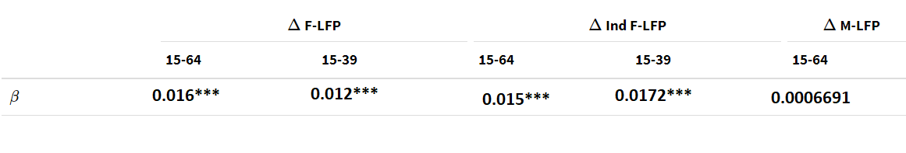

```{r setup, include=FALSE}

knitr::opts_chunk$set(echo = FALSE)

options(htmltools.dir.version = FALSE)

library(pacman)


# Non-geo packages

p_load(readxl, tidyverse, knitr, gridExtra, stargazer, broom, magick, cowplot, gganimate, ggplot2, ggrepel, kableExtra)

# geo packages
p_load(sp, sf) 

p_load(conflicted)
conflict_prefer("select", "dplyr")
conflict_prefer("filter", "dplyr")
conflict_prefer("lag", "dplyr")


# Define pink color
red_pink <- "#e64173"
turquoise <- "#20B2AA"
grey_light <- "grey70"
grey_mid <- "grey50"
grey_dark <- "grey20"
# Dark slate grey: #314f4f
# Knitr options
opts_chunk$set(
  comment = "#>",
  fig.align = "center",
  warning = F,
  message = F
)
opts_chunk$set(dev = "svg")
options(device = function(file, width, height) {
  svg(tempfile(), width = width, height = height)
})
```

---
# Empirical specification

\begin{align*}
\Delta Export \space Exposure_{s,t} =& \alpha_{s,t-10}^{knit} * \Delta Knit \space Export_{t-10} + \\
&\alpha_{s,t-10}^{Woven} * \Delta Woven \space Export_{t-10} \\
\textit{and } \alpha_{s,t-10}^{knit} =& \frac{Machines_{s,knit,t-10}}{Machines_{BD-Knit,t-10}},\\
\alpha_{s,t-10}^{Woven} =& \frac{Machines_{s,woven,t-10}}{Machines_{BD-Woven,t-10}},
\end{align*}


---

# Identification

- **Goldsmith-Pinkham et al 2020:** The regional industry shares are exogenous to the **changes** in outcomes, not levels.

--

- **Borusyak et al 2022**: The shifts are exogenous.

--

  - Or, there are many shifts which cancel each other out to some extent, so the combination is exogenous.

--

- A combination of all of above.

--

My argument is that the shares are exogenous to changes in this context. The shifts, maybe?


---
# Some additional factory data issues

- I do not have a true panel of factories, and do not observe dropouts.

--

- I am panelizing the data based on i) establishment date, and based on the assumption that factories do not grow  much, or that factories do not change their production in a really meaningful way.

---

# Factory data soruces

- .hi[With Mapped in Bangladesh (MiB) project.] All factory data is observed between 2017-2021. Does not account for exiting factories.

--

- BGMEA data from directory 2000-01 and directory 2009-10.

  - Does not have some data needed for the panelization.
  
--

- BGMEA data from 2015.
  
  - Cannot be authenticated.
  
---
# Findings from BGMEA directory

```{r, include=F}

fac01 <- read_excel("~/large_datasets/BD Garments/bgmea_factory_data_final.xlsx", sheet = "bgmea_01")

fac09 <- read_excel("~/large_datasets/BD Garments/bgmea_factory_data_final.xlsx", sheet = "bgmea_09")

fac_bgmea <- read_excel("~/large_datasets/BD Garments/bgmea_factory_data_final.xlsx", sheet = "bgmea_2015_final")

fac_mib <- read_excel("~/large_datasets/BD Garments/rmg_mib_shihab_edit.xlsx")


```


```{r, include=FALSE}

exit_till01 <- max(fac01$bgmea_num) - length(fac01$bgmea_num)

stayer_01_09 <- inner_join (fac01, fac09, by = "bgmea_num")

exit_01_09 <- length(fac01$bgmea_num) - length(stayer_01_09$bgmea_num)

remainers_01_09 <- stayer_01_09$bgmea_num

fac01 <- fac01 %>% mutate(remainer = as.integer(bgmea_num %in% remainers_01_09))

fac01 %>% group_by(remainer) %>% summarize(Machine = mean(machine, na.rm= T))
```

## Rate of exit

- 18 exits over 24 years.

- 499 exit over 10 years. Or, 50 a year $\implies 1.55 \%$ a year.

  - BTE paper finds that 96.4 percent of firms keep exporting between $t$ and $t-1$ in 2004-2009 period.
  
--
## Who exits?

```{r}

fac01 %>% group_by(remainer) %>% summarize(Machine = mean(machine, na.rm= T))

```


---
# Changes within factory
## Growth

- median growth is zero


---
# Comparision of date of establishment

```{r, fig.height=6}

p1 <- fac_bgmea %>%
  filter(date_est <=2000) %>%
  ggplot(aes(x=date_est)) +
  geom_histogram()+
  labs(title = "Entry dates BGMEA data")


p2 <- fac_mib %>%
  filter(date_est <=2000) %>%
  ggplot(aes(x=date_est)) +
  geom_histogram()+
  labs(title = "Entry dates MiB data")

plot_grid(p1, p2)
```

---
# Results

## Old regression

```{r fig.height = 4, fig.width = 8}
include_graphics("figures//regs1.png")
```

## New

```{r fig.height = 4, fig.width = 8}

```

# Interpretations

- Mean values imparts very similar impact 3.17 pp versus 1.44 in overlall FLFP
- 3.36 pp in industrial FLFP for younger cohorts against 2.24 pp in earlier cases

- Compared to Heath and Mubarak (2015), 3.17 makes sense.

  - Mean urban share is 0.45 and median is 0.23. Savar (one of their surveyed upazila) had an urbanization rate of 0.21, which leads to a impact of about 3.15 pp increase.
  
--- 
# Next steps

- A bit confused about how to make the case using the - **Goldsmith-Pinkham et al 2020:** The regional industry shares are exogenous to the **changes** in outcomes, not levels.

- Let me show you the data I have.

--

knit_share = f( ? ) 